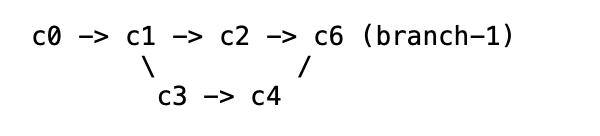

# Topo Sort

This program recursively searches up the file tree for a git directory. It creates a 
commit graph consisting of all the commit nodes from all the branches. Finally, it 
topologically sorts the commit graph in a deterministic fashion. 

## Running 
```
Python3 topo_order_commits.py
```

## Output 
In a specific block of text, (line X+1)  ->  (Line X) represents a parent->child relationship. Thus root nodes will 
always appear to be at the bottom of a block of text, but not every bottom is a root node. 

The "=" signs are used to help reconstruct the tree. If the next commit to be printed is not the parent of the current commit, there will be a "="
appended to the current commit. 
The following block leading with the "=" will contain the commit hashes of the parents of the next commit

## Sample Output

#### Commit Graph 1: 


#### Output: 


#### Commit Graph 2: 



#### Output: 


